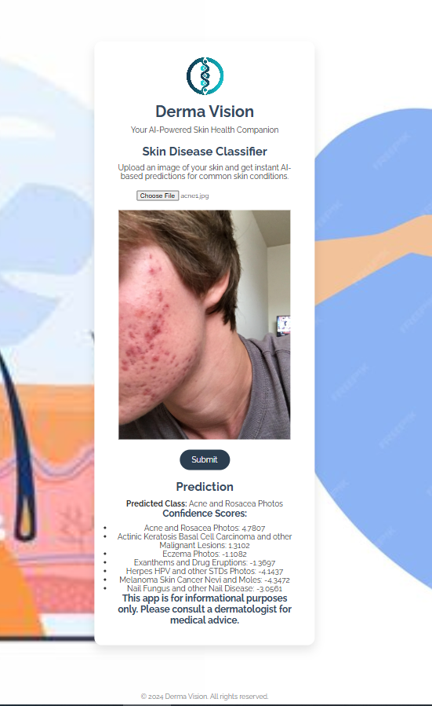

# dermavision

## Overview
Derma Vision is an AI-powered skin disease classifier that helps users identify potential skin conditions through image analysis. I used the ResNet-34 Model, fine-tuned it on the DermNet dataset with 23 classes and 19,500 images. The number of classes were reduced to 6, using the confusion matrix, to increase model accuracy in real time applications to 91%. A basic UI was made using HTML/CSS and Flask API was used as a bridge between the UI and model at the backend.

# Derma Vision - Skin Disease Classifier

*link to finetuned resnet-34 model uploaded on huggingface:* https://huggingface.co/abdlh/ResNet34_finetuned_for_skin_diseases_by-abdlh/blob/main/skin_model2.pth

## Features
- Upload skin images
- AI-powered disease classification for 'Acne and Rosacea Photos',
    'Actinic Keratosis Basal Cell Carcinoma and other Malignant Lesions',
    'Eczema Photos',
    'Exanthems and Drug Eruptions',
    'Herpes HPV and other STDs Photos',
    'Melanoma Skin Cancer Nevi and Moles',
    'Nail Fungus and other Nail Disease'
- Model Trained on Dermnet dataset
  
## Technologies
- Python
- Flask
- PyTorch
- HTML/CSS

## Disclaimer
This app is for informational purposes only. Always consult a healthcare professional.
